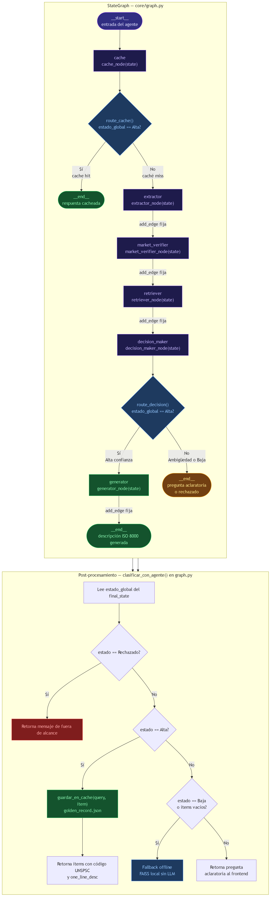

# Catalogador MRO — Asistente de Compras ISO 8000

Sistema de clasificación semántica multi-agente para requisiciones técnicas de Mantenimiento, Reparación y Operaciones (MRO). Toma requerimientos en lenguaje libre, clasifica cada ítem en el catálogo **UNSPSC** (49,000 clases) y genera una **descripción estandarizada ISO 8000** en una sola línea, lista para ERP o solicitud de cotización a proveedores.

---

## 🗺️ Diagramas del Sistema

### 1. Grafo LangGraph Puro (`core/graph.py`)

Representación fiel y exacta del `StateGraph` compilado. Muestra los nodos de LangGraph, sus puntos de entrada/salida y las funciones de arista condicional (`route_cache`, `route_decision`), así como la capa externa de post-procesamiento en `clasificar_con_agente()`.



---

### 2. Flujo Completo del Sistema y Lógica de Nodos

Detalle paso a paso de lo que ocurre **dentro** de cada nodo (extracción con LLM, salvaguardas por sustantivo, verificación en DuckDuckGo, búsqueda RAG en FAISS con boosting, auditoría paramétrica ISO 8000 y formateo posicional determinista en Python por familia):


---

## ⚙️ Arquitectura Modular

El sistema está orquestado con **LangGraph** y una cascada de múltiples LLMs con fallback automático. Todo el backend de IA reside en el directorio `core/`:

```text
Proyecto Alura/
├── app.py                        # Servidor Flask (punto de entrada)
├── core/
│   ├── graph.py                  # Definición del StateGraph (LangGraph)
│   ├── state.py                  # Esquemas de datos (AgentState, ProductItem)
│   ├── models.py                 # Cascada de LLMs con fallback automático
│   ├── config.py                 # Sinónimos, marcas, diámetros comerciales
│   ├── rag/
│   │   └── faiss_engine.py       # Motor de búsqueda FAISS + keyword boosting
│   ├── nodes/
│   │   ├── cache.py              # Golden Record (caché persistente JSON)
│   │   ├── extraction.py         # Extractor de entidades (Llama 3.3)
│   │   ├── retrieval.py          # Verificador web + RAG FAISS
│   │   └── decision.py           # Auditor ISO 8000 + Generador posicional
│   └── prompts/
│       └── templates.py          # Prompts del extractor, decisor y generador
├── data/                         # Índice FAISS + metadatos UNSPSC
├── docs/
│   ├── flujo_sistema.mmd         # Fuente Mermaid del diagrama del sistema
│   ├── flujo_sistema.png         # Renderizado PNG del flujo del sistema
│   ├── langgraph_puro.mmd        # Fuente Mermaid del diagrama LangGraph
│   └── langgraph_puro.png        # Renderizado PNG del grafo LangGraph
├── static/ & templates/          # Frontend (chat UI)
├── Dockerfile & docker-compose.yml
└── run.bat / run.sh
```

---

## 🧠 Nodos del Grafo

| # | Nodo Registrado | Función Interna | Salida / Decisiones |
|---|---|---|---|
| 1 | `cache` | Busca coincidencia en `golden_record.json` | `estado_global = Alta` (Hit) o `Baja` (Miss) |
| 2 | `extractor` | Expande jergas/abrevs. Extrae ítems con Llama 3.3. Filtra especialidad. | Lista de `items` con `categoria_dominio` |
| 3 | `market_verifier` | Evalúa si requiere contexto de mercado y consulta DuckDuckGo (caché SQLite). | `market_context` inyectado en cada ítem |
| 4 | `retriever` | Búsqueda vectorial FAISS (49k UNSPSC) + Keyword boosting léxico. | Top-8 candidatos por ítem |
| 5 | `decision_maker` | Auditoría ISO 8000 con Claude 3.5. Evalúa P/N, conflictos y datos faltantes. | `estado_global` (`Alta`, `Ambigüedad`, `Baja`) |
| 6 | `generator` | Genera descripción con LLM y aplica formatters posicionales deterministas en Python. | `one_line_desc` limpia en MAYÚSCULAS |

---

## 🏭 Familias Soportadas

| Familia | Sustantivos | Estructura ISO 8000 de Salida |
|---|---|---|
| **Fluidos / Hidráulica** | TUBERIA, VALVULA, BRIDA, CODO, NIPLE, FITTING | `TUBERIA [MAT], [DIAM], SCH [N], [NORMA], [EXTREMOS], [LONGITUD]` |
| **Cómputo / TI** | SMARTPHONE, LAPTOP, MEMORIA, DISCO, IMPRESORA | `SMARTPHONE [MARCA] [MODELO], [GB], [GB RAM], [RED], [COLOR]` |
| **Instrumentación / Eléctrica** | MOTOR, CAUDALIMETRO, TRANSMISOR, INTERRUPTOR | `MOTOR ELÉCTRICO [HP], [V], [FASES], [RPM], [HZ], CARCASA [N]` |

---

## 🛡️ Salvaguardas Críticas

| Salvaguarda | Descripción |
|---|---|
| **Filtro duro de P/N** | Si el usuario provee un P/N unívoco, clasifica directamente sin solicitar más atributos. |
| **Bypass de modelo comercial** | Para modelos específicos (Samsung 990 Pro, Galaxy A54), omite preguntas de datasheet. |
| **Deducción de RPM** | Con Hz y polos deduce `RPM = (120 × f) / p` y norma NEMA/IEC automáticamente. |
| **Conflicto geométrico** | Detecta incompatibilidades físicas (ej: SSD 990 Pro + M.2 2242) y solicita corrección. |
| **Coherencia norma-material** | Las opciones de norma solo incluyen estándares compatibles con el material declarado. |
| **Anti-fricción infinita** | Prohíbe solicitar clase de eficiencia, certificación adicional u otros atributos secundarios que no afectan la compra. |
| **Golden Record** | Cada ítem clasificado se cachea. Consultas repetidas se resuelven sin LLM. |

---

## 🔁 Cascada de Fallback LLM

- **Extractor / Generador**: `Groq` → `DeepSeek` → `SiliconFlow` → `Mistral` → `Gemini`
- **Decisor / Auditor**: `OpenRouter (Claude)` → `DeepSeek` → `Groq` → `SiliconFlow` → `Mistral` → `Gemini`

---

## 🚀 Instalación y Ejecución

### Windows
```cmd
run.bat
```

### macOS / Linux
```bash
chmod +x run.sh && ./run.sh
```

### Docker (producción)
```bash
docker-compose up -d --build
```

---

## 🌐 API

### `POST /api/classify`

```json
// Request
{ "query": "Válvula compuerta 6 IN clase 150 bridada acero al carbono con volante" }

// Response exitosa
{
  "estado": "Alta",
  "items": [{
    "codigo_exacto": 40141616,
    "nombre_producto": "Válvulas de compuerta",
    "one_line_desc": "VALVULA COMPUERTA 6 IN, CL150, BRIDADA, CUERPO ASTM A216 WCB, DISCO ACERO AL CARBONO, ASIENTO LATÓN, CON VOLANTE, API 600",
    "criticidad": "Media",
    "requiere_revision_humana": false
  }]
}
```

---

## 📄 Variables de Entorno (`.env`)

```env
GROQ_API_KEY=...
OPENROUTER_API_KEY=...
DEEPSEEK_API_KEY=...
SILICONFLOW_API_KEY=...
MISTRAL_API_KEY=...
GEMINI_API_KEY=...
FLASK_SECRET_KEY=...
```
