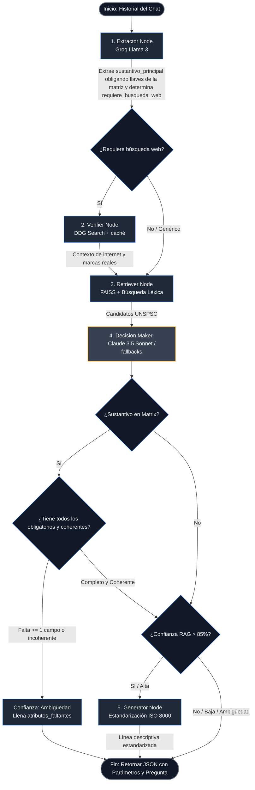

# Flujo del Agente LangGraph — Chat Bot UNSPSC Paramétrico

Este diagrama representa el flujo completo y detallado del agente con el nuevo sistema de indagación de atributos paramétricos para compras MRO industriales.

## Descripción de Nodos y Nuevas Lógicas

| Nodo | Rol / Tecnología | Detalle de la Refactorización |
|---|---|---|
| `Start` | Entrada de Historial | Recibe los turnos conversacionales completos desde SQLite. |
| **extractor** | Groq (Llama-3.3 70B) | Mapea la jerga del usuario. **Salvaguarda de Normalización:** Se inyectan las llaves exactas de `MATRIZ_ATRIBUTOS_MRO` para forzar a que use el sustantivo exacto de la familia. Determina el flag `requiere_busqueda_web` (booleano) para discernir si es genérico o requiere conectarse a internet. |
| **verifier** | DuckDuckGo Search API | Busca fichas técnicas en internet para resolver marcas específicas y modelos. **Atajo de Latencia:** Si `requiere_busqueda_web` es `false`, se salta esta búsqueda para ahorrar tiempo. |
| **retriever** | FAISS + Léxica local | Encuentra los 8 candidatos UNSPSC más cercanos combinando distancias vectoriales y coincidencia por palabras clave. |
| **decision_maker** | Claude 3.5 / Llama / fallbacks | Realiza la **auditoría de atributos críticos**:  • Cruza TAGs de instrumentación con el contexto de DuckDuckGo para inferir el equipo. • Auto-aprueba materiales técnicos si detecta siglas (`HDPE`, `PVC`, `PTFE`, `INOX`). • **Validación de Coherencia:** Comprueba que los valores provistos en `atributos_recolectados` sean técnicamente lógicos (si son absurdos, los considera como faltantes). • Si faltan campos obligatorios o incoherentes, asigna `"Ambigüedad"` y rellena `atributos_faltantes`. |
| **generator** | Groq (Llama-3.3 70B) | Redacta la descripción técnica normalizada en una línea bajo el estándar ISO 8000. |
| `End` | Salida JSON | Devuelve la clasificación final o el listado de parámetros recolectados y faltantes para renderizar el formulario en el frontend. |

## Auditoría de Atributos de la Matriz MRO

Si el `sustantivo_principal` coincide con alguno de la matriz, se exigen los siguientes campos:

*   **TUBERIA**: `material`, `diametro`, `sdr_o_cedula`, `presion_o_norma`.
*   **MUELA**: `tipo_muela_movil_o_fija`, `dimensiones_chancadora`, `material_o_manganeso`, `marca_equipo_destino`.
*   **MEMORIA**: `capacidad_gb`, `tecnologia_ddr`, `compatibilidad_equipo`.
*   **MANDIL**: `material_o_proteccion`, `talla`, `color`.
*   **INTERRUPTOR**: `tipo_de_contacto`, `aplicacion_o_tecnologia`, `tag_o_numero_parte`.
*   **LAPTOP**: `procesador`, `memoria_ram`, `almacenamiento_ssd`.
*   **CELULAR**: `almacenamiento`, `color`.

